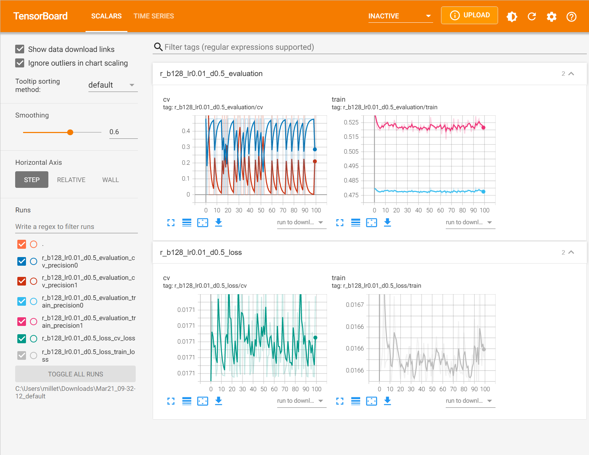
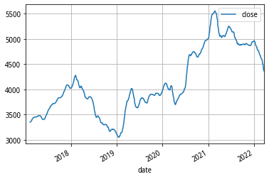
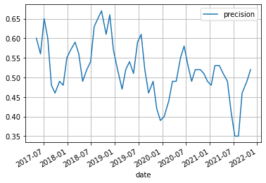

## 回归模型

## 沪深300指数: 2017-2022

## 沪深300指数：2022

## 五年数据训练,未来预测: 2022
- data_path = 'data/cs_space_1d_rate_20d_2022_pre'
- model_path = 'models/model_c2_p[[0.0, 0.3], [0.7, 1.0]]_b32_lr0.001_d0.5_e500.pth'

[0:20] average precision: tensor([0.3950, 0.0000])

## 五年数据训练，历史回测：2017-2022
- data_path = 'data/cs_space_20d_rate_20d_2017_pre'
- model_path = 'models/model_c2_p[[0.0, 0.3], [0.7, 1.0]]_b32_lr0.001_d0.5_e500.pth'

[0: 20] average precision: tensor([0.5833, 0.0000])

[20: 40] average precision: tensor([0.5275, 0.0000])

[40: 60] average precision: tensor([0.5200, 0.0000])

[60: 80] average precision: tensor([0.5233, 0.0000])

[80: 100] average precision: tensor([0.5058, 0.0000])
